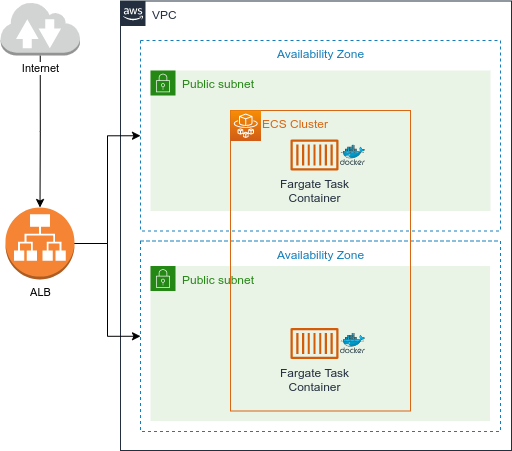

# terraform-ecs-ecr
Terraform script to run a Docker application on AWS using ECS ​​Fargate

([Click here to access tutorial documentation](https://www.zup.com.br/blog/ecs-fargate)){:target="_blank"}

